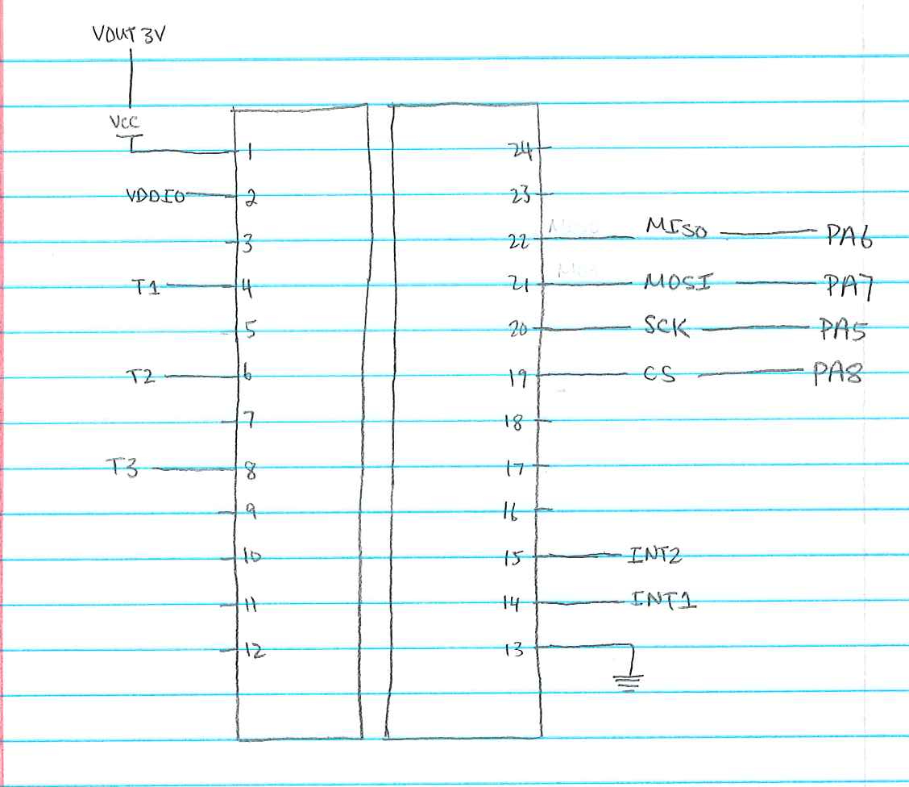

#### input format:
1. gyro r/w address value : reads or writes to a certain address
2. gyro r all : read from all accessible gyro addresses
3. press r/w address value : reads or writes to address
4. press r all : reads from all accessible pressure sensor address 
5. altitude f/m : returns altitude in feet or meters

#### functions?
1. pressure_read_register : reads from a certain address from the pressure sensor
2. pressure_write_register : attempts to write to an address for the pressure sensor 
3. gyro_read_register : reads from a certain address from the gyro
4.  gyro_write_register : attempts to write to an address for the gyro 
5. mbar_alt : take pressure sensor information and calculate the millibars, then into feet of air
6. ft_m : converts feet to meters
7. cmd_gyro : controls gyro options
8. cmd_press : controls pressure sensor information
9. cmd_altitude : gives information about the altitude in feet or meters

####Threads:
1. counterThread: blinks the North led light

####Schematic?

####difficulties:
It took some time to look at the datasheet and figure out what wires were to connect with what. Once that was established, there were certain things I had to do with the millibar information in order for us to print decimals in feet and meters.

####Just something:
